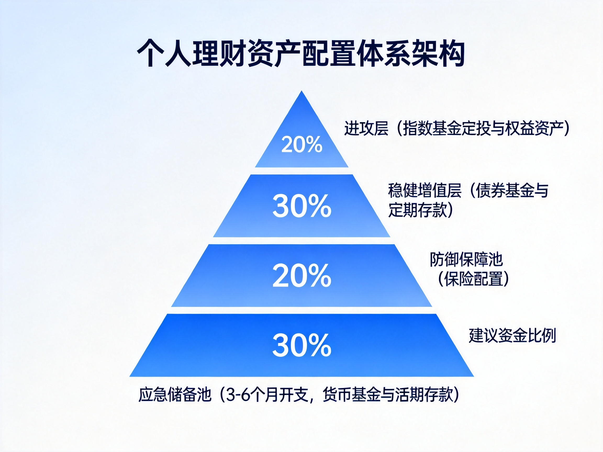
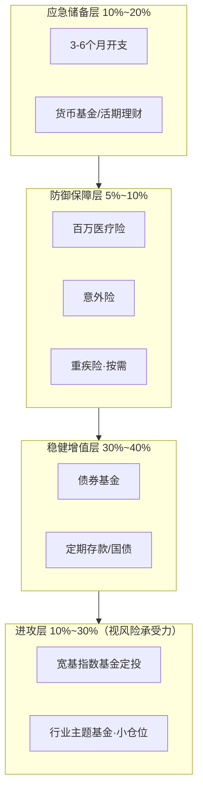
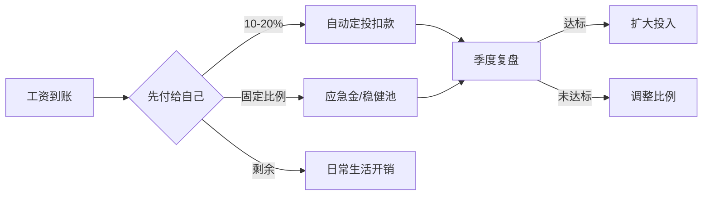
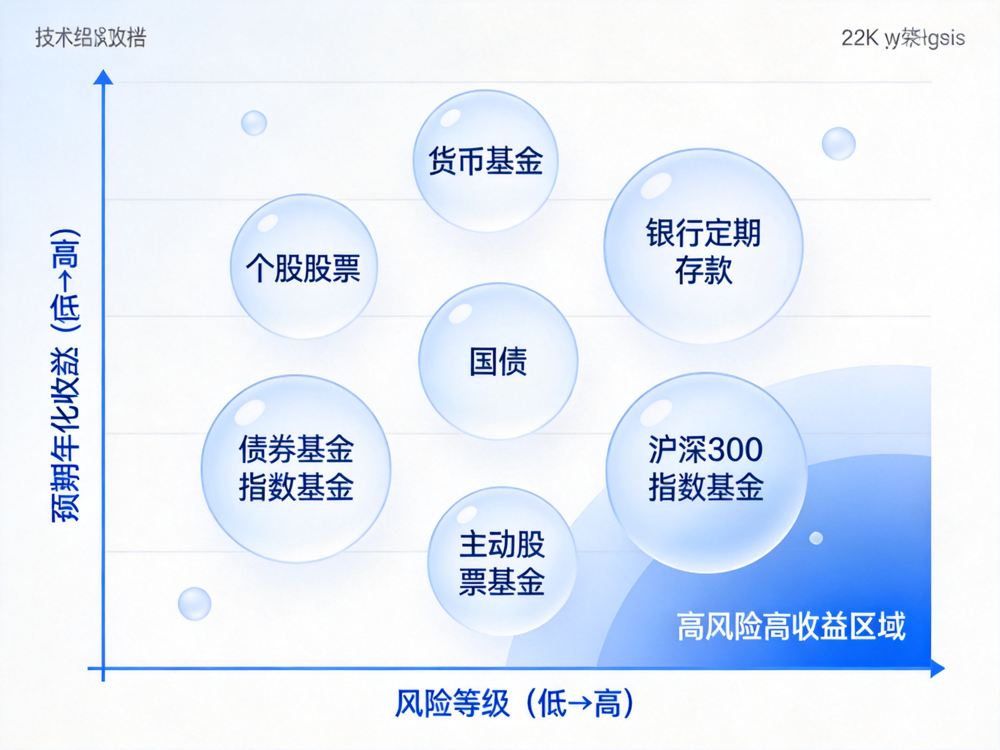

# 小白理财技术方案：从零开始的个人资产配置系统实施指南

> **文档定位**：基于知乎社区高赞理财讨论的系统化梳理，面向零基础理财人群的可落地实施方案
> **信息来源**：知乎搜索（理财入门、基金定投、资产配置、避坑防骗等 4 组主题，30+ 条高质量回答）
> **免责声明**：本文仅为知识整理与学习框架，不构成任何投资建议。市场有风险，投资需谨慎。文中数据来自公开资料，可能存在滞后。

---

## 一、问题背景（Why）

### 1.1 为什么普通人必须学理财

**宏观环境的三重挤压**，使得"只靠存银行"的传统财富保值方式正在失效：

| 压力因素 | 现状 | 对普通人的影响 |
|---|---|---|
| 利率持续下行 | 银行定存利率进入"1时代"，大额存单利率普遍跌破 2% | 存款收益跑不赢通胀，实际购买力缩水 |
| 通胀常态化 | 2026 年 CPI 同比回升至 1% 以上 | 现金类资产隐性贬值 |
| 刚兑打破 | 资管新规后理财产品不再保本保息 | "闭眼买理财"的时代结束，需要具备辨别能力 |

知乎专栏《小白理财系列：普通人资产配置入门框架》中给出一组关键数据：截至 2025 年末，全国住户本外币存款余额高达 **167 万亿元**，人均存款约 **11.89 万元**。这说明中国人不是没钱，而是陷入了一个尴尬困局——**存银行跑不过通胀，买理财不再保本，投股票承受不住波动**。以沪深 300 指数为例，2022 年单年下跌超 21%，2023 年再跌 11%，2024-2025 年分别反弹 14.68% 和 17.66%，这种过山车式波动，没有任何资产配置知识的普通家庭根本无法承受。

**结论：理财知识已经从"加分项"变成"必修课"。**

### 1.2 小白理财的典型误区

从知乎相关话题的高赞回答中，可以提炼出新手最常见的五大认知误区：

**误区一：理财 = 投资 = 买股票/基金**

知乎答主"羽度非凡"在《普通人想开始理财，第一步应该做什么》中明确指出：

> 理财（资产配置）是**战略层面**的全盘规划，解决"不同属性的钱该怎么分配"；投资是**战术层面**的具体操作，解决"用于增值的资金如何挑选标的与执行策略"。

跳过资产配置直接冲入市，是新手亏钱的首要原因。

**误区二：钱少不用理财**

理财的核心是**现金流管理和储蓄习惯**，与本金大小无关。月入 8000 元建立正确的收支结构，比月入 5 万却月光的人更有财务前途。复利的前提是"有本金可持续投入"。

**误区三：追求高收益，忽视风险**

知乎高赞观点："很多人亏钱，不是因为不懂，是因为不害怕。"对收益率的贪念会让人忽视底层资产——年化 6% 以上且承诺"保本"的产品，在当下几乎必然暗藏风险。

**误区四：把止损当成风控的全部**

知乎答主"阿光"指出："真正的风控首先不是止损，而是**仓位**。"仓位决定面对波动时的心理状态，下跌 10% 时小仓位可以冷静分析，重仓甚至加杠杆则情绪完全失控。很多投资问题表面是策略问题，实际是仓位问题。

**误区五：一次性投入 + 追涨杀跌**

"手里有 5 万块，一次性全买了，结果买完第二天跌 5%，心态直接崩了"——这是知乎基金话题下出现频率最高的新手事故。正确做法是定投摊平成本，而非择时赌博。

### 1.3 现有学习路径的缺陷

| 现有路径 | 缺陷 |
|---|---|
| 跟风买网红产品 | 无底层认知，遇到波动必然割肉 |
| 报"理财训练营" | 多数以卖课/导流开户为目的，9.9 元引流课质量存疑 |
| 直接看股票技术分析 | 跳过资产配置和风险管理，等于不会游泳先跳深水区 |
| 只看书不实操 | 知识无法内化，真实波动面前依然失控 |

**本文档的价值**：把知乎社区经过数万人验证的理财共识，整合为一套**分阶段、可执行、可检验**的系统方案，让小白在最短时间内建立完整的理财操作体系。

---

## 二、核心原理（What）

### 2.1 复利：理财的数学基石

复利公式是理解一切长期投资的起点：

$$FV = PV \times (1 + r)^n$$

其中 $FV$ 为终值，$PV$ 为现值（本金），$r$ 为年化收益率，$n$ 为年数。

**72 法则**（估算资产翻倍年限）可由上式推导：对两边取对数得 $n = \ln 2 / \ln(1+r)$，当 $r$ 较小时 $\ln(1+r) \approx r$，因此：

$$n \approx \frac{0.693}{r} \approx \frac{72}{100r}$$

即年化 6% 时约 12 年翻倍，年化 10% 时约 7.2 年翻倍。这个法则揭示了两件事：

1. **收益率的微小差异，长期影响巨大**：6% 与 10% 的差距，翻倍时间相差近一倍；
2. **时间是复利最重要的输入**：25 岁开始每月投 2000 元（年化 8%），到 60 岁约 458 万；35 岁开始同样投入，到 60 岁只有约 190 万——晚 10 年，少 268 万。

### 2.2 定投的数学原理：平均成本被"熨平"

定期定额投资（定投）的本质是**用纪律对抗择时焦虑**，其数学原理是"调和平均数效应"。

设每月定投金额固定为 $A$，第 $i$ 期的基金份额净值为 $p_i$，则第 $i$ 期买入份额为 $A / p_i$。$n$ 期后的平均持仓成本为：

$$\bar{p} = \frac{\text{总投入}}{\text{总份额}} = \frac{nA}{\sum_{i=1}^{n} \frac{A}{p_i}} = \frac{n}{\sum_{i=1}^{n} \frac{1}{p_i}}$$

这正是各期净值的**调和平均数**。由均值不等式，调和平均数恒小于等于算术平均数：

$$\bar{p} = \frac{n}{\sum_{i=1}^{n} \frac{1}{p_i}} \le \frac{1}{n}\sum_{i=1}^{n} p_i$$

**直观含义**：净值低时同样金额买到的份额更多，自动实现"低位多买、高位少买"，长期平均成本低于简单算术平均价格。这就是知乎答主所说的"定投熨平成本"——**不需要判断现在是不是低点，只要市场长期向上，时间会给出回报**。

**定投收益的前提条件**（缺一不可）：

1. 标的长期趋势向上（所以首选宽基指数，不选单一行业）；
2. 坚持穿越完整周期（通常 3 年以上，知乎多篇文章以 2015 年股灾后的沪深 300 定投回测佐证）；
3. 有止盈纪律（"不止盈，坐过山车"，后文 4.5 节详述）。

### 2.3 风险与收益：风险溢价原理

金融学的基本规律是**风险与预期收益成正比**，其理论基础是风险补偿：

$$E(R_i) = R_f + \beta_i \times (E(R_m) - R_f)$$

即 CAPM 模型：资产的预期收益 $E(R_i)$ 等于无风险利率 $R_f$ 加上风险溢价。其中 $\beta_i$ 衡量资产相对市场的波动敏感度，$E(R_m) - R_f$ 是市场风险溢价（A 股长期约 5-7 个百分点）。

**对小白最重要的三个推论**：

1. **无风险利率是收益的"锚"**：当前约 1.5-2%（参考短债/货基），任何承诺显著高于此且"保本"的产品都值得警惕；
2. **高收益必然伴随高波动**：想要年化 8%+ 就必须接受账户可能阶段性回撤 20-30%，这不是产品缺陷，是风险定价；
3. **分散化是唯一"免费午餐"**：通过持有相关性低的多种资产，可以在不降低预期收益的前提下降低组合波动（马科维茨组合理论的核心结论）。

### 2.4 资产配置的底层逻辑：标准普尔象限图

标准普尔（S&P）调研全球十万个资产稳健增长的家庭后总结的"家庭资产象限图"，将资产分为四个账户，是知乎理财社区引用率最高的框架：

| 账户 | 建议比例 | 用途 | 对应工具 |
|---|---|---|---|
| **要花的钱**（短期消费） | 约 10% | 3-6 个月日常开销 | 货币基金、活期理财 |
| **保命的钱**（保障） | 约 20% | 应对意外重疾 | 医疗险、重疾险、意外险 |
| **生钱的钱**（进攻） | 约 30% | 为家庭创造收益 | 指数基金、股票（高风险高收益） |
| **保本的钱**（防守） | 约 40% | 养老金、教育金等刚性目标 | 国债、定期存款、债券基金 |

> **注意**：象限图比例是参考值而非教条。知乎答主普遍强调，年轻人收入成长期可以适度提高进攻比例，临近退休则应提高保本比例；**唯一不可动摇的原则是：应急的钱和保命的钱必须优先配置**。

### 2.5 行为金融学：小白亏钱的真正根源

知识决定下限，**人性决定上限**。知乎社区反复出现的结论是：绝大多数新手不是输在选股，而是输在情绪。三个必须认识的行为偏差：

**1. 损失厌恶**：失去 100 元的痛苦 ≈ 得到 200-250 元的快乐（卡尼曼前景理论）。这导致新手在亏损时"装死不动"（拒绝确认损失），在微利时"落袋为安"（过早确认收益）——恰好与"截断亏损、让利润奔跑"的正确操作完全相反。

**2. 羊群效应**：牛市末期开户数暴增、熊市底部无人问津，是人性使然。应对方法是把决策写成规则（定投日、止盈线），用纪律替代临场判断。

**3. 过度自信**：连续盈利后放大仓位，是爆仓的经典路径。应对方法是设定单一资产上限仓位（如单只基金不超过总资产 30%），并且**任何情况下不用杠杆**。

### 2.6 核心原理小结

> 理财的本质是一个**三约束优化问题**：在流动性约束（应急可取）、安全性约束（本金可控）和收益目标的三角中做权衡。复利提供数学引擎，定投提供执行纪律，资产配置提供风险框架，行为管理提供人性保险——四者缺一不可。

---

## 三、系统架构（Architecture）

### 3.1 总体架构：四层资金池体系

综合知乎高赞答主"羽度非凡"的 5 资金池模型与标准普尔象限图，本文设计适合中国普通上班族的**四层金字塔架构**（见图 1）：



*图 1：四层资产配置金字塔，风险自下而上递增，塔基越稳塔尖才能越高*



### 3.2 各层职责与工具选型

| 层级 | 核心职责 | 关键约束 | 推荐工具 | 关键参数 |
|---|---|---|---|---|
| **应急储备层** | 应对失业、疾病等突发支出 | 流动性第一，收益零容忍纠结 | 货币基金、银行活期理财 | 3-6 个月月均开支 |
| **防御保障层** | 转移人身风险，防止一夜返贫 | 先保障后理财，保额优先 | 百万医疗险、意外险、定期寿险 | 年保费控制在年收入 5-10% |
| **稳健增值层** | 跑赢通胀的压舱石 | 低波动，期限匹配刚性目标 | 短债/纯债基金、定期存款、国债 | 久期 1-3 年为主 |
| **进攻层** | 博取长期超额收益 | 只用 3 年以上不用的钱 | 沪深300/中证500 指数基金定投 | 月投入 = 收入 10-20% |

### 3.3 数据流：工资到账后的资金流转



**关键设计决策**：

1. **"先支付自己"原则**：发薪后第 2 天自动扣款定投，先储蓄后消费，而非"消费剩余再储蓄"——这是知乎所有入门帖的共同结论；
2. **收支平衡线**：月总消费控制在收入的 40%-60%，区分"必需消费"与"欲望消费"；
3. **资金池隔离**：四个池子用不同账户/平台物理隔离，避免混用挪用。

### 3.4 模块关系说明

- **应急储备是进攻层的保险丝**：知乎答主"虎叔聊财商"强调，投资的前提是"这笔钱亏了不影响正常生活"，应急金不足时禁止进入进攻层；
- **保障层是全家资产的防火墙**：知乎"中产返贫"讨论中反复出现的三件套——高杠杆、教育支出过高、收入来源单一——全部可以通过保险+现金流管理对冲；
- **稳健层与进攻层存在动态再平衡**：每年或每半年检查一次比例，偏离目标超过 5 个百分点时执行再平衡（详见 4.6）。

---
## 四、方案详情（How）

### 4.0 总览：五阶段实施路线图


*图 2：五阶段学习路径，预计总周期 6 个月完成基础建设，之后进入持续运行态*

| 阶段 | 目标 | 周期 | 验收标准 |
|---|---|---|---|
| 阶段一：财务体检 | 摸清家底，建立记账习惯 | 第 1 个月 | 连续记账 30 天，输出资产负债表 |
| 阶段二：筑基 | 应急金 + 保险配置完成 | 第 1-3 个月 | 应急金达标，医疗险/意外险生效 |
| 阶段三：认知建设 | 读完 3 本必读书 | 第 2-4 个月 | 能讲清指数基金定投原理 |
| 阶段四：实战试水 | 小资金开始定投 | 第 4 个月起 | 自动定投运行满 3 期 |
| 阶段五：复盘扩展 | 季度复盘，逐步加码 | 持续 | 形成个人投资手册 |

### 4.1 阶段一：财务体检与记账（第 1 个月）

**目标**：回答三个问题——我有多少钱？每月花多少？能拿出多少投资？

**操作步骤**：

1. **盘点资产**：列出所有账户余额（银行卡、余额宝、零钱通、基金、股票、公积金），得到总资产；
2. **盘点负债**：信用卡欠款、花呗/白条、房贷车贷；净资产 = 总资产 - 总负债；
3. **记账 30 天**：用随手记/钱迹等工具，只记不评判，月底按"必需/欲望"分类；
4. **计算关键指标**：

| 指标 | 公式 | 健康线 |
|---|---|---|
| 储蓄率 | （月收入 - 月支出）/ 月收入 | ≥ 30%（低于 10% 先解决消费问题） |
| 应急金缺口 | 6 × 月均支出 - 现有流动资产 | ≥ 0 才算达标 |
| 负债收入比 | 月还款额 / 月收入 | ≤ 40%（超过先降杠杆） |
| 可投资额 | 月收入 × 10%~20% | 定投启动资金 |

**避坑**：不要一开始就追求记账完美，漏记几天的数据用估算补齐，重点在坚持 30 天形成习惯。

### 4.2 阶段二：筑基——应急金与保险（第 1-3 个月）

**应急金配置**：

- 额度：月均支出 × 3~6（自由职业/收入不稳定取 6，体制内稳定收入取 3）；
- 存放：货币基金（余额宝、零钱通、银行活期理财），标准是**随时可取、无波动**，不追求收益率；
- 例：月支出 4000 元 → 应急金 1.2 万~2.4 万元。

**保险配置（保障优先，保额优先）**：

| 险种 | 优先级 | 预算参考 | 要点 |
|---|---|---|---|
| 百万医疗险 | ★★★★★ | 200-400 元/年 | 覆盖大额住院医疗，人人必备 |
| 意外险 | ★★★★★ | 100-300 元/年 | 杠杆最高，含意外医疗 |
| 重疾险 | ★★★★ | 3000-6000 元/年 | 家庭经济支柱优先，保额 ≥ 3 年年收入 |
| 定期寿险 | ★★★（有家庭责任才买） | 500-1500 元/年 | 保额覆盖房贷 + 抚养责任 |

**总保费控制在年收入 5%-10%**。先大人后小孩，先保障后理财，**坚决不买"返还型"保险**（保费贵一倍，保障打对折）。

### 4.3 阶段三：认知建设书单（第 2-4 个月）

知乎理财话题高赞书单汇总，按阅读顺序排列：

| 顺序 | 书名 | 作者 | 解决的问题 |
|---|---|---|---|
| 1 | 《小狗钱钱》 | 博多·舍费尔 | 金钱观启蒙，建立储蓄习惯 |
| 2 | 《富爸爸穷爸爸》 | 罗伯特·清崎 | 资产/负债思维（创业房产观点辩证看） |
| 3 | 《指数基金投资指南》 | 银行螺丝钉 | 定投完整操作体系，本土化最好 |
| 4 | 《漫步华尔街》 | 伯顿·马尔基尔 | 理解市场有效性，建立长期主义 |
| 5（进阶） | 《邻家的百万富翁》 | 斯坦利 | 打破"高薪=富有"错觉 |

知乎答主"蓝色星空"的建议很有代表性："普通人把《漫步华尔街》和《指数基金投资指南》认真看完，指数基金的投资体系就足够用了。"

**学习方法**：边读边记笔记，每本读完用 500 字复述核心观点（费曼学习法）。**这个阶段不要投钱**——知乎高赞观点：书比课便宜得多，也靠谱得多，警惕任何 9.9 元"理财训练营"的转化套路。

### 4.4 阶段四：指数基金定投实战（第 4 个月起）

**标的选择（新手铁律：宽基为主）**：

| 原则 | 说明 | 反面例子 |
|---|---|---|
| 宽基为主 | 覆盖全行业，分散风险 | 行业基金（新能源、医药等） |
| 被动指数 | 规则透明，费用低 | 主动管理基金（依赖基金经理） |
| 大市值优先 | 流动性好，波动相对小 | 小盘股基金 |

**起步组合（知乎高频推荐）**：

- 保守型：100% 沪深300 指数基金；
- 均衡型：沪深300 50% + 中证500 50%（大盘+中盘，覆盖更广）。

**选基金四看指标**：

1. 跟踪误差：< 0.3% 优秀；
2. 费率：管理费+托管费合计 < 0.6%；
3. 规模：2 亿~100 亿之间（太小防清盘，太大防船大难掉头）；
4. 成立时间：≥ 3 年，有完整业绩可查。

**渠道选择**：

| 渠道 | 特点 | 适合人群 |
|---|---|---|
| 支付宝/天天基金（场外） | 可设自动定投，门槛低 | 新手首选 |
| 券商 App（场内 ETF） | 费率更低，需手动买入 | 有股票账户后迁移 |

**定投参数设置（知乎共识版）**：

| 参数 | 建议值 | 理由 |
|---|---|---|
| 每月金额 | 收入的 10-20% | 不影响生活才能拿得住 |
| 扣款日 | 发薪后第 2 天 | 先付给自己，防止花掉 |
| 频率 | 每月 1 次 | 与周定投长期收益差异极小 |
| 最低坚持期 | 3 年 | 穿越一轮市场周期 |
| 单只上限 | 总资产 30% | 分散风险 |

### 4.5 进阶：止盈策略与智能定投

**止盈是定投的灵魂**——"会买的是徒弟，会卖的才是师傅"。三种主流方法：

**方法一：目标收益率止盈（最简单）**

设定年化 15%（或累计 30%-50%）为止盈线，到达后全部或分批卖出，利润落袋，本金开启下一轮定投。

**方法二：估值温度止盈（银行螺丝钉体系）**

利用指数 PE/PB 历史百分位判断"温度"：

- 温度 < 30（低估区）：正常定投，可加码至 1.5-2 倍；
- 30 ≤ 温度 ≤ 70（正常区）：正常定投；
- 温度 > 70（高估区）：停止买入，分批卖出（每涨 10% 卖出 1/4）。

**方法三：最大回撤止盈**

浮盈从最高点回撤 10% 触发卖出，适合趋势行情锁定利润。

> 新手推荐：先跑通"方法一"，能稳定执行后再升级到"方法二"。

### 4.6 再平衡机制（每年执行一次）

每年末检查四层资金池实际比例与目标比例的偏离度：

- 偏离 < 5 个百分点：不操作（避免过度交易）；
- 偏离 ≥ 5 个百分点：卖出超配层、买入低配层，恢复目标比例。

**再平衡的本质是纪律化的"高抛低吸"**，同时强制检视保险保额是否仍匹配收入（收入涨，保额也应涨）。

### 4.7 常见故障排查

| 症状 | 根因 | 处理方案 |
|---|---|---|
| 定投 3 个月就坚持不住 | 投入金额过大影响生活 | 降至收入 5% 重启，先养习惯 |
| 一跌就想割肉 | 没理解波动是收益的来源 | 回看 2.2 节调和平均原理；只投"亏了不心疼"的钱 |
| 总想择时抄底 | 过度自信偏差 | 关闭行情软件，删除自选股，只保留自动扣款 |
| 被"高收益保本"产品吸引 | 不了解风险溢价原理 | 默念：年化 > 6% 且保本 = 大概率骗局 |
| 急用钱动了定投账户 | 应急金不足 | 回到阶段二补足应急金，资金池物理隔离 |

---
## 五、伪代码与执行清单（Code）

### 5.1 防骗决策树：先于一切操作的防火墙

央视财经与各地反诈通报反复出现的套路可归纳为四步：精准引流（打造"金融导师"权威人设）→ 长期洗脑（免费荐股建立信任）→ 诱导下载假冒平台（如假冒券商"内部软件"）→ 无法提现跑路。**任何投资操作前，先跑这个决策树**：

```python
def fraud_check(opportunity: dict) -> str:
    """投资防骗防火墙：任何一项命中红牌即终止"""
    red_flags = [
        opportunity["承诺保本"] and opportunity["年化收益"] > 0.06,   # 高收益+保本=庞氏
        opportunity["下载渠道"] not in ("官方应用商店", "持牌机构官网"),  # 陌生链接/二维码下载
        opportunity["要求"] in ("交保证金", "先交税费才能提现", "发展下线"),
        opportunity["资质查询"] is None,  # 证监会/银保监会查不到牌照
        opportunity["催促决策"],           # "限时名额""今天不投就没了"
    ]
    if any(red_flags):
        return "终止，卸载拉黑，国家反诈中心App举报"
    # 通过初筛后仍需验证：
    assert 查询持牌(机构名称), "无牌照不碰"
    assert 资金流向 == "本人银行账户/持牌机构托管", "转账给个人=诈骗"
    return "进入正常评估流程（仍需小仓位试错）"
```

**知乎反诈答主（李旭反传团队）的三招验 App**：① 看下载方式——正规 App 必能在官方应用商店搜到；② 查资质——证监会官网查牌照；③ 看资金流向——正规投资资金在银行/券商托管，**绝不会让你转账给个人或陌生公司账户**。

### 5.2 每月财务执行主循环

```python
class PersonalFinanceSystem:
    """个人理财系统主循环：发薪日触发"""

    def monthly_routine(self, salary):
        # 1. 先支付自己（顺序不可颠倒）
        invest = salary * self.invest_ratio          # 10%~20%
        emergency = salary * self.emergency_ratio     # 补足应急金
        self.auto_invest(invest, day="发薪+2日")       # 自动定投扣款
        self.transfer(emergency, target="货币基金")

        # 2. 剩余资金安排生活
        living = salary - invest - emergency
        self.budget(living, cap=salary * 0.6)          # 消费上限60%

        # 3. 记账（每日），月底分类复盘
        self.record_expenses()

    def quarterly_review(self):
        """季度复盘：只调比例，不预测市场"""
        ratio = self.current_allocation()
        if abs(ratio["应急金"] - self.target["应急金"]) > 0.05:
            self.rebalance()
        if self.invest_profit_rate() >= self.stop_profit_line:  # 年化15%
            self.take_profit(method="分批卖出")
            self.restart_new_cycle()

    def yearly_review(self):
        """年度复盘：保险保额检视 + 投资手册更新"""
        if self.income_growth() > 0.2:
            self.increase_insurance_coverage()
        self.update_investment_policy_book()
```

### 5.3 分阶段落地路径（最小可行 → 完整版）

| 版本 | 内容 | 达成标志 |
|---|---|---|
| **v0.1 最小版** | 记账 + 发薪自动转 10% 进货基 | 连续 3 个月现金流为正 |
| **v0.5 基础版** | 应急金达标 + 医疗险意外险配齐 | 阶段二验收通过 |
| **v1.0 标准版** | 宽基指数定投自动运行 + 止盈线设定 | 定投满 12 期未中断 |
| **v2.0 完整版** | 四层资金池全配置 + 年度再平衡 + 个人投资手册 | 能独立回答"为什么这样配" |

### 5.4 个人投资手册模板（落地后必须写）

把决策规则写在纸面上，是知乎定投系列（夹心Jas《制作定投计划》）反复强调的："让任何一个拿到这个计划的人，都可以执行出相同的效果"。模板：

```text
【我的投资手册 v1.0】
1. 目标：____ 年积累 ____ 万元，用于（养老/教育/购房）
2. 可投期限：____ 年（<3年的钱不进权益池）
3. 定投计划：标的____，每月____元，扣款日____
4. 止盈规则：____（收益率/估值温度）
5. 风控红线：单资产上限30%，永不加杠杆，不动应急金
6. 复盘节奏：季度看比例，年度做再平衡
7. 情绪预案：大跌20%时我的动作是____（默认：继续定投，不卖出）
```

---

## 六、思考与展望（Thinking）

### 6.1 工具谱系：风险-收益全景对比



*图 3：小白常用工具的风险-收益分布，新手活动范围应集中在左下至中部区域*

| 工具 | 风险等级 | 预期年化（参考） | 流动性 | 新手适配度 |
|---|---|---|---|---|
| 货币基金 | ★ | 1.5-2% | 极高（T+0） | 应急金专用 |
| 银行定期存款 | ★ | 1.5-2.5% | 中（提前支取损失利息） | 稳健层打底 |
| 国债 | ★ | 2-2.5% | 中 | 长期闲钱 |
| 债券基金 | ★★ | 2-5% | 高 | 稳健层主力 |
| 宽基指数基金 | ★★★★ | 长期 6-10%（波动大） | 高 | 定投主战场 |
| 主动股票基金 | ★★★★☆ | 波动极大，依赖经理 | 高 | 有认知后再碰 |
| 个股 | ★★★★★ | 不确定 | 高 | 新手禁区 |

### 6.2 方案的优势与局限

**优势**：

1. **低认知门槛**：核心操作（记账、应急金、定投）不需要金融专业背景；
2. **反人性设计**：自动扣款 + 书面规则，用制度对冲情绪；
3. **渐进可控**：五阶段设计保证每一步都在能力圈内，错了随时回退；
4. **成本极低**：指数基金管理费约 0.5%/年，远低于主动基金 1.5%+，长期复利差距显著。

**局限（必须如实说明）**：

1. **不承诺收益**：定投平均成本原理依赖"市场长期向上"的前提，若定投期恰逢长期熊市（如日股 1990-2012），回本周期会远超预期；
2. **通胀与利率环境变化**：本文引用的收益率数据为当前环境参考值，利率进一步下行会压缩稳健层收益；
3. **不适合短期目标**：3 年内要用的钱（买房首付、结婚费用）不适用权益定投；
4. **知乎信息本身需甄别**：社区回答有幸存者偏差，本文已尽量取多方共识，但具体产品选择仍需自行核实。

### 6.3 与其他理财路径的对比

| 路径 | 学习成本 | 预期收益 | 风险 | 适合人群 |
|---|---|---|---|---|
| **本方案（配置+定投）** | 低 | 中 | 可控 | 上班族小白（本文目标读者） |
| 主动炒股 | 极高 | 分化极大 | 高 | 有时间精力持续研究者 |
| 买主动基金"选人" | 中 | 分化大 | 中高 | 愿意研究基金经理者 |
| 纯存款/国债 | 零 | 低 | 极低 | 风险零容忍/近期用钱 |
| 跟投大V/买课程组合 | 低 | 不确定 | 中（含信任风险） | 不推荐：把决策权让渡他人 |

### 6.4 关键共识与独立判断

汇总本次知乎调研中**跨答主、跨话题反复出现**的结论（可信度最高）：

1. **"亏了不心疼"是入场的前提**（虎叔聊财商、蓝色星空等多处印证）；
2. **宽基 + 定投 + 长线**是新手三件套（几乎所有一线答主一致）；
3. **先保障后投资**，保险不是理财工具而是风险防火墙；
4. **书优于课，课优于带单**——9.9 元训练营的终点是卖高价课；
5. **写下来才能执行**——书面计划是对抗情绪的唯一可靠工具。

**独立判断**：对绝大多数上班族，理财收益的大头来自**储蓄率**（本金）而非**收益率**（技巧）。月收入 1 万储蓄率 40%，胜过月收入 1 万收益率 10%。因此本方案把财务体检和现金流管理放在第一阶段，而非直接教买基金——这是与市面多数"理财速成"内容最大的差异。

### 6.5 行动清单（今天就可以开始）

- [ ] 下载记账软件，开始记录每一笔支出
- [ ] 盘点所有账户，算出净资产
- [ ] 计算应急金缺口，设定补足计划
- [ ] 检查是否有百万医疗险（没有则配置）
- [ ] 下单《指数基金投资指南》，本周读完前三章
- [ ] 设置发薪日 +2 天的自动转账（哪怕先只转 500 元）

---

## 附录：主要参考来源（知乎）

1. [普通人想开始理财,第一步应该做什么?](https://www.zhihu.com/question/2052490700982327283/answer/2078189667753710436) — 羽度非凡（5 资金池模型）
2. [对于一个零基础的理财小白,第一步应该做什么?](https://www.zhihu.com/question/1958933239814127694/answer/2074256414407667973) — 虎叔聊财商
3. [第一次尝试买指数基金,完全零基础应该怎么操作?](https://www.zhihu.com/question/1991464461668737918/answer/2038986800086135070) — fenix
4. [新人如何买基金?](https://www.zhihu.com/question/661454537/answer/2051677009454035992) — 系统工程师的成长
5. [指数基金投资指南4:制作定投计划](https://zhuanlan.zhihu.com/p/2062105699497391154) — 夹心Jas
6. [新手想接触指数基金定投,怎么投收益更高?](https://www.zhihu.com/question/2050617102080512569/answer/2058243469043316683) — 小白兔想吃肉
7. [30岁存款不多,想开始定投指数基金,有哪些入门建议和避坑指南?](https://www.zhihu.com/question/1971176259036902259/answer/2010754536202080665) — 蓝色星空
8. [新手第一次怎么买基金?](https://www.zhihu.com/question/461008938/answer/2025913627413095168) — 叶微（公募基金从业7年）
9. [央视曝光投资理财骗局,这类骗局有哪些常见套路?](https://www.zhihu.com/question/2022072408966799738/answer/2067987338232434812) — 东阳公安
10. [别碰!这33个项目全是诈骗](https://zhuanlan.zhihu.com/p/2073183969986794372) — 李旭反传团队
11. 投资里最危险的误解:以为设置了止损就等于控制住了风险 — 阿光（仓位优先于止损的风控观）
12. [小白理财系列(一):普通人资产配置入门框架](https://zhuanlan.zhihu.com/p/2069373288426558065)
13. [标准普尔象限图:一张图看懂家庭资产怎么配](https://zhuanlan.zhihu.com/p/2037278272875127321)
14. [为了实现财务自由,您都做了哪些有价值的事呢?](https://www.zhihu.com/question/1986623491575932275/answer/2075244330005049674)

> 注：以上链接为知乎开放平台搜索返回的原始链接，部分内容可能因作者删除而失效；引用观点以文中归纳为准。

---

*文档结束 · 基于知乎开放平台搜索数据整理 · 仅供学习参考，不构成投资建议*
