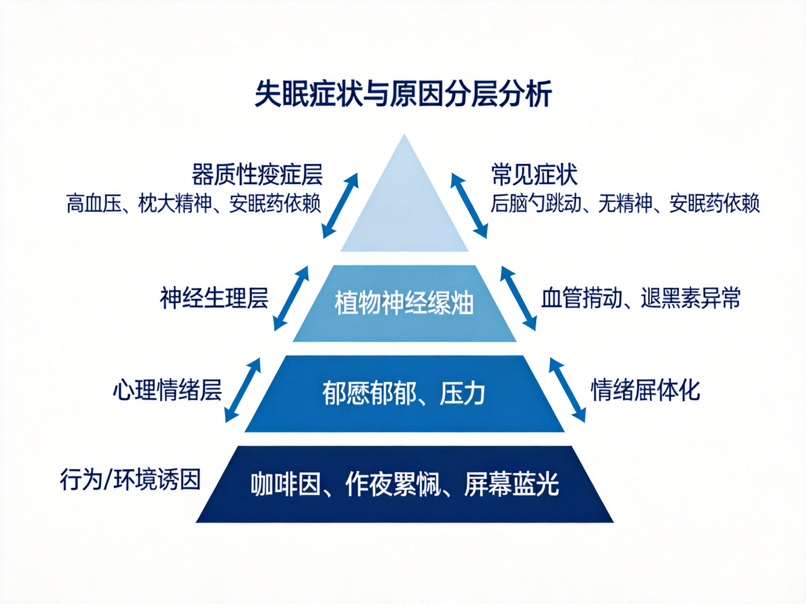
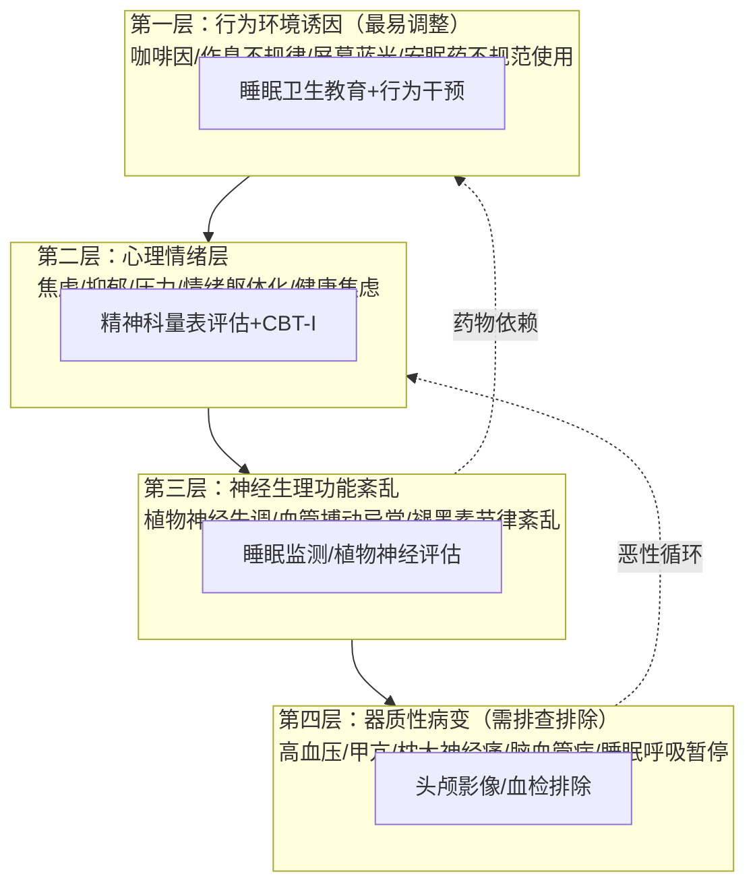
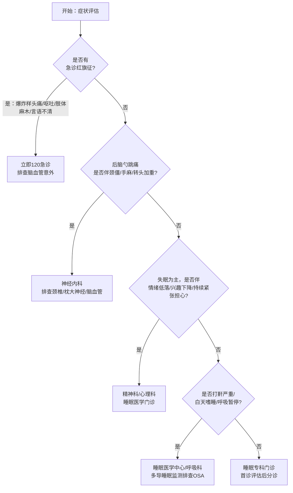
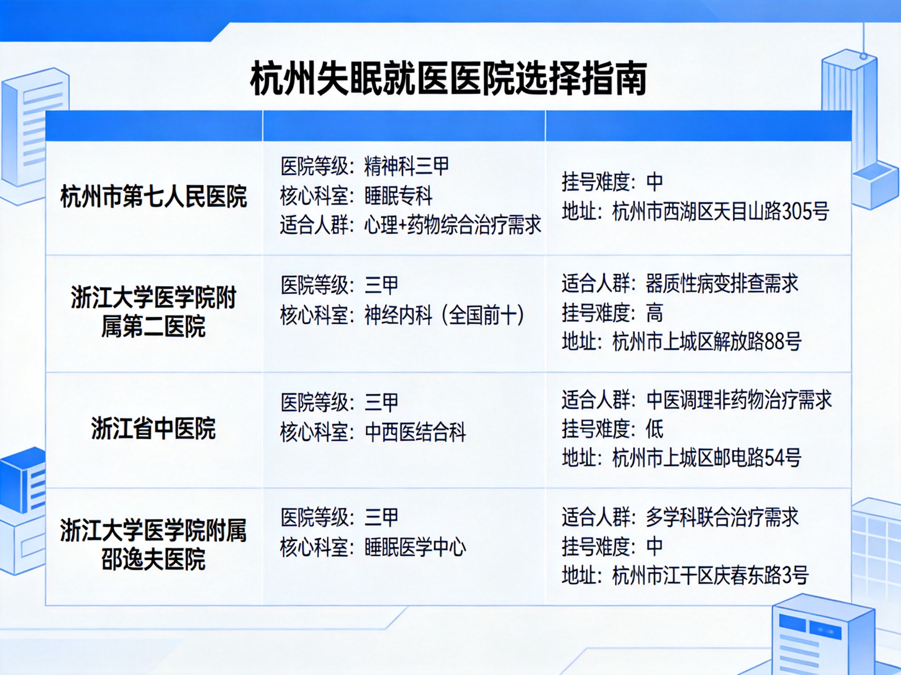
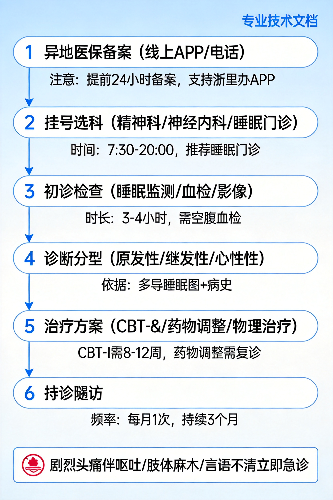

# 长期失眠伴后脑勺搏动与安眠药依赖就医全指南：杭州就诊方案+异地医保流程

> **医疗免责声明**：本文档为基于知乎社区公开讨论与通用医学知识整理的信息参考，**不构成任何医疗诊断或用药建议**。具体诊疗方案必须由正规医院执业医师根据个人检查结果制定，请勿自行调整药物剂量或戒断。出现剧烈头痛伴呕吐/肢体麻木/言语不清/突发意识障碍时，请立即拨打120急诊。
> **信息来源**：知乎搜索（失眠病因、安眠药戒断、杭州医院推荐、异地医保流程共6组主题，25+条高质量回答），结合公开医院信息整理。

---

## 一、问题背景（Why）

### 1.1 用户核心症状画像
基于描述归纳的典型症状组合：
| 症状维度 | 具体表现 | 持续特征 |
|---|---|---|
| 睡眠障碍 | 长期夜间失眠，只能依赖安眠药入睡 | 慢性病程，已出现药物依赖 |
| 躯体症状 | 后脑勺跳动感（搏动性） | 与失眠同步出现，夜间/清醒时明显 |
| 日间功能损害 | 白天无精神、精力不足 | 已影响正常工作生活 |
| 心理状态 | 担心身体出问题，存在健康焦虑 | 焦虑-失眠-躯体不适形成恶性循环 |

**紧急提示**：如果后脑勺跳动伴随**突发剧烈爆炸样头痛、呕吐、肢体麻木、言语不清、视物重影、意识模糊**，请立即前往急诊排查脑血管意外（蛛网膜下腔出血等），不要按常规失眠流程挂号。

### 1.2 为什么这个症状组合不能硬扛
知乎神经内科、精神科答主反复强调的三个风险点：

1. **慢性失眠本身就是疾病**：按照ICSD-3（国际睡眠障碍分类第三版）诊断标准，**每周≥3次、持续≥3个月**的入睡困难/睡眠维持困难/早醒，且造成白天功能损害，即可诊断为**慢性失眠障碍**，属于需要医学干预的疾病，不是"忍忍就好"。

2. **后脑勺跳动不是"想多了"**：知乎答主"呼呼深睡眠"（睡眠领域创作者）指出，该症状本质是**睡眠不足导致的脑血管舒张收缩功能异常**，合并颅周肌肉紧张，长期不干预会加重血管神经敏感性，进入"失眠→血管痉挛→更失眠"的恶性循环。长期还会升高高血压、心脑血管事件风险。

3. **长期自行吃安眠药风险极高**：苯二氮䓬类（艾司唑仑、阿普唑仑、氯硝西泮等）连续使用超过4周就可能产生依赖和耐受，自行停药会出现反跳性失眠、心慌、出汗、头痛、烦躁甚至 seizures 戒断反应；非苯二氮䓬类（右佐匹克隆、唑吡坦等）虽然依赖风险相对较低，但长期使用仍需医生指导滴定减停。知乎答主"颜柯"（精神科方向高赞答主）明确指出：**靠谱的医生一定会交代服药时长、减药方案，不会让患者自行长期吃**。

### 1.3 常见认知误区
| 误区 | 实际情况 |
|---|---|
| "失眠就是神经衰弱，自己调理就行" | 慢性失眠可能是焦虑/抑郁、植物神经紊乱、甲亢、高血压、睡眠呼吸暂停等多种疾病的表现，需先排查器质性病因 |
| "安眠药吃了就断不掉，不如硬扛" | 规范使用下新型非苯二氮䓬类依赖风险可控，硬扛导致的长期睡眠剥夺损害远大于规范用药收益；关键是**在医生指导下用和停** |
| "后脑勺跳是脑出血/脑梗前兆，吓都吓死了" | 搏动性跳痛绝大多数是血管功能性异常（血管性头痛/紧张性头痛），但需要影像学检查排除器质性病变才能放心 |
| "看失眠就去神经内科" | 原发性失眠、情绪相关失眠、药物依赖戒断优先**精神科/睡眠专科**；排查器质性病变去神经内科 |
| "异地医保报销很麻烦，先自费看再说" | 提前1天在国家医保服务平台APP备案，出院直接结算，门诊住院都可报；不备案报销比例大幅降低甚至无法直接结算 |

### 1.4 本文档解决的问题
1. 症状与可能病因分层分析，帮你判断严重程度和就诊优先级
2. 规范就医全流程（科室选择→检查项目→治疗方案→减药路径）
3. 杭州地区靠谱医院/科室/专家推荐（按适应症分类，不是简单排名）
4. 异地医保备案到结算全流程（含备案类型、APP操作、材料准备、常见坑点）
5. 就诊前准备清单、可落地的非药物干预方案

---

## 二、核心原理（What）

### 2.1 正常睡眠的生理机制
正常睡眠分为**非快速眼动睡眠（NREM，含浅睡、深睡）**和**快速眼动睡眠（REM，做梦期）**，以约90分钟为周期循环：
- 深睡期（N3期）是身体修复、激素分泌（生长激素、褪黑素）、记忆巩固的关键阶段，长期失眠最先损害的就是深睡比例；
- 睡眠-觉醒周期由**下丘脑视交叉上核（SCN）**调控，受褪黑素、皮质醇节律、光照、体温共同影响；
- 正常成人睡眠结构：入睡潜伏期<30分钟，觉醒次数<2次/晚，深睡占比15-25%，总时长7-9小时。

慢性失眠患者的核心异常是**过度觉醒（hyperarousal）**：交感神经持续兴奋，皮质醇节律紊乱，夜间本该抑制的交感神经仍处于高张力状态，表现为"躺下脑子停不下来、能感觉到血管跳动、一点声音就醒"。

### 2.2 "后脑勺跳动"的病理生理
知乎神经内科答主将该症状归纳为三类机制，可单独或合并存在：

**机制一：血管性搏动（最常见）**
睡眠不足→脑代谢紊乱→脑耗氧增加→相对缺氧→脑血管代偿性异常舒张/收缩→表现为与脉搏同步的搏动感，位置多在枕部（后脑勺）、太阳穴，本质是血管运动功能失调，属于功能性异常，但需排除高血压、血管畸形等器质性问题。

**机制二：颅周肌肉紧张/紧张性头痛**
长期失眠、焦虑→颈枕部肌肉持续收缩→局部缺血、代谢产物堆积→表现为后脑勺紧箍样、搏动样疼痛，常伴颈部僵硬、按压有痛点，按摩热敷可暂时缓解。

**机制三：枕大神经痛**
病毒感染、颈椎退变压迫枕大神经→阵发性电击样/搏动样疼痛，可向头顶放射，需神经科查体鉴别。

**危险信号（提示器质性病变，必须急诊）**：
$$P(器质性病变) \gg 90\% \quad \text{当满足以下任一条件}$$
- 突发"人生最剧烈头痛"（爆炸样）
- 伴喷射性呕吐、颈项强直
- 伴肢体麻木/无力、言语不清、视物成双
- 伴发热、意识改变
- 50岁后新发头痛、或头痛模式近期明显改变

### 2.3 安眠药分类与依赖机制
| 分类 | 代表药物 | 半衰期 | 依赖风险 | 常见副作用 |
|---|---|---|---|---|
| 苯二氮䓬类（旧型） | 艾司唑仑、阿普唑仑、氯硝西泮、地西泮 | 中长效（6-50h） | **高**，连续用>4周易依赖 | 次日宿醉效应、跌倒风险、记忆损害、耐药性 |
| 非苯二氮䓬类（新型Z药） | 右佐匹克隆、唑吡坦、扎来普隆 | 短效（1-6h） | 较低（规范使用） | 口苦、头晕，次日残留少 |
| 褪黑素受体激动剂 | 褪黑素、雷美替胺 | 短 | 极低 | 次日嗜睡，适合节律紊乱 |
| 镇静类抗抑郁药 | 米氮平、曲唑酮、多塞平 | 中长 | 无 | 体重增加、口干，适合伴抑郁焦虑者 |

**依赖产生的核心机制**：苯二氮䓬类药物作用于GABA_A受体，长期使用会导致受体下调、敏感性下降，需要越来越大剂量才能达到同样效果（耐受）；突然停药时受体功能不足，出现反跳性兴奋（戒断）：失眠加重、焦虑、震颤、心慌、出汗，严重时可出现癫痫发作。

**规范减药原则（必须医生指导）**：
$$\text{每1-2周减原剂量的} \ 10\%-25\%$$
整个减药周期通常需要数周到数月，严禁骤停；可在医生指导下换用半衰期更长的药物桥接，或用非苯二氮䓬类逐步替代。

### 2.4 情绪躯体化：查不出问题的痛
知乎答主"心隅解忧杂货铺"（心理领域）指出：很多跑医院做CT、核磁、验血都查不出器质性问题的失眠、头痛、心慌，根源是**长期未处理的焦虑/压力被压抑后转化为躯体症状**——心理学叫"躯体化障碍"。
- 机制：杏仁核持续激活交感神经→血管收缩、肌肉紧张、内分泌紊乱→出现实实在在的躯体疼痛/失眠，但器官本身没有病变；
- 特点：症状多系统（头痛、失眠、胃胀、胸闷、乏力同时存在）、时好时坏、情绪不好时加重、检查全正常；
- 处理：这种情况看普通内科/神内往往效果有限，需要**精神科/心理科**评估，CBT（认知行为治疗）+ 必要时小剂量抗焦虑药效果更好。

### 2.5 CBT-I：失眠的一线非药物治疗
国际睡眠指南一致推荐**CBT-I（失眠认知行为治疗）**为慢性失眠的**首选一线治疗**，效果优于长期药物，无副作用：
1. **认知重构**：纠正"我必须睡够8小时""睡不着就完了"等灾难化认知；
2. **睡眠限制**：减少卧床时间，提高睡眠效率，重建床=睡觉的条件反射；
3. **刺激控制**：床只用来睡觉和性生活，20分钟睡不着就起床，不刷手机；
4. **睡眠卫生**：固定起床时间、下午后不喝咖啡、睡前1小时不看屏幕、卧室凉爽黑暗；
5. **放松训练**：腹式呼吸、渐进性肌肉放松、正念。

通常CBT-I由精神科/睡眠专科医生或心理治疗师指导，周期4-8周，有效率70-80%，疗效可长期维持。

---
## 三、系统架构（Architecture）

### 3.1 症状-病因分层体系


*图 1：症状病因从表层行为到深层器质性病变的四层金字塔模型，层间双向箭头表示恶性循环*



### 3.2 就诊科室决策树


**科室选择原则**：
- **首诊优先**：杭州市第七人民医院睡眠障碍专科（一站式评估，可处理药物依赖）
- **排查器质性病变**：浙二医院神经内科
- **中西医结合调理**：浙江省中医院神经内科/神志病科
- **严重打鼾/睡眠呼吸暂停**：邵逸夫医院睡眠医学中心

### 3.3 杭州医院资源矩阵


*图 2：杭州地区4家治疗失眠的核心医院，按适应症、科室优势、挂号难度分类*

| 医院 | 等级/专科 | 核心科室 | 最适合人群 | 挂号难度 | 地址 |
|---|---|---|---|---|---|
| **杭州市第七人民医院**<br/>(浙大附属精神卫生中心) | 三甲精神专科 | 睡眠障碍专科、焦虑抑郁科 | 原发性失眠、伴焦虑抑郁、安眠药依赖戒断、情绪躯体化 | 中等（专家号提前1-2周） | 余杭区天目山路305号 |
| **浙大二院** | 三甲综合，神内全国前十 | 神经内科、头痛专科 | 怀疑器质性病变、后脑勺痛明显、伴其他神经症状 | 较难（专家号紧俏） | 上城区解放路88号/滨江区江虹路1511号 |
| **浙江省中医院** | 三甲中医 | 神经内科、神志病科、针灸科 | 希望中西医结合、不愿长期吃西药、轻中度失眠 | 中等 | 上城区邮电路54号/钱塘区 |
| **邵逸夫医院** | 三甲综合 | 睡眠医学中心（多学科） | 睡眠呼吸暂停、复杂睡眠障碍、需要多导睡眠监测 | 中等 | 上城区庆春东路3号/钱塘区 |

**七院重点专家参考**（知乎患者分享整理，仅供参考，以医院当日排班为准）：
- **曹日芳 主任医师**：擅长广泛性焦虑、抑郁、睡眠障碍，药物+心理咨询综合干预，适合伴焦虑失眠患者
- **江长旺 主任医师**：擅长睡眠障碍、躯体化障碍、植物神经紊乱、老年焦虑
- **毛洪京**：睡眠障碍科主任，主攻失眠CBT-I治疗

### 3.4 就医全流程架构


*图 3：异地医保备案到复诊随访的完整就医流程*

### 3.5 关键设计决策
1. **先备案再就医**：异地医保备案可线上全程办理，备案后门诊住院直接结算，报销比例最高；未备案报销比例下降15-20个百分点，且需垫付后回参保地手工报销
2. **首诊带齐资料**：既往病历、安眠药用药史（具体药名、剂量、服用时长）、既往检查报告、症状日记
3. **不要求第一次就挂专家号**：首诊可以先挂普通号开检查单（睡眠监测、血检、影像），结果出来后再挂专家号解读，节省时间和费用
4. **药物调整缓慢进行**：减安眠药是周/月级别的过程，不是一次门诊就能完成，需预留复诊计划

---
## 四、方案详情（How）

### 4.0 总览：分阶段实施计划
| 阶段 | 时间 | 核心任务 | 产出 |
|---|---|---|---|
| 阶段0：出发前准备 | 就医前1-3天 | 异地医保备案、整理病史资料、挂号 | 备案成功截图、病史清单、挂号凭证 |
| 阶段1：首诊评估 | 第1天 | 医生面诊、开具必要检查 | 检查单、初步诊断方向 |
| 阶段2：检查与确诊 | 1-7天 | 完成检查、复诊解读结果 | 明确诊断、治疗方案 |
| 阶段3：治疗启动 | 确诊后1-4周 | 开始药物/心理/物理治疗，建立睡眠节律 | 药物滴定到位、睡眠日记启动 |
| 阶段4：维持与减药 | 1-6个月 | 定期复诊、逐步减停安眠药、巩固CBT-I技能 | 药物减停或最小维持、睡眠稳定 |

### 4.1 阶段0：出发前准备（重中之重）

#### 4.1.1 异地医保备案全流程
依据国家医保局2022年22号文及知乎实操经验（护士"半亩清禾"、杭州参保用户"蓝调水火"验证）：

**备案类型选择**：
| 备案类型 | 适用场景 | 有效期 | 报销比例 |
|---|---|---|---|
| 异地转诊人员 | 参保地医院开转诊证明 | 按转诊单 | 最高（参保地政策降5%内） |
| 临时外出就医 | 自行去外地看病，无转诊 | 通常6-12个月 | 比转诊低约10-15% |
| 异地长期居住 | 在杭州居住/工作≥6个月 | 长期 | 与参保地同比例 |

> **注意**：多数省份已取消转诊证明强制要求，临时外出就医可直接备案。具体政策以参保地医保局为准，可打参保地区号+12393咨询。

**备案操作步骤（推荐线上，最快当天生效）**：
1. 下载「**国家医保服务平台**」APP，注册实名认证；
2. 首页→「异地备案」→「异地就医备案申请」；
3. 选择参保地、就医地（浙江省/杭州市）、备案类型、备案起止日期；
4. 按提示上传材料（临时就医一般只需身份证，长期居住需居住证明）；
5. 提交后1-2个工作日审核，最快2小时通过；
6. 备案成功后可在APP「异地就医备案记录查询」查看状态；
7. 支付宝/微信搜索「异地就医备案」小程序可同步操作。

**结算规则**：
- 备案成功后，在杭州**医保定点医院**（所有三甲医院都是）挂号、缴费时出示医保电子凭证（APP/支付宝卡包），**直接刷卡结算**：报销部分医保直接垫付，你只付自付部分；
- 门诊和住院都支持直接结算；
- 如遇系统故障无法直接结算，保留好所有发票、费用清单、诊断证明、出院小结，回参保地医保局手工报销。

**避坑点（知乎高赞反复提醒）**：
- ⚠️ **一定要在去医院前备案**，入院后补备案部分地区不认可；
- ⚠️ 备案时就医地选**杭州市**（或浙江省），不要只选某一家医院；
- ⚠️ 医保电子凭证提前激活，实体医保卡也带上备用；
- ⚠️ 特殊药品（如部分精神类药物）异地目录可能有差异，可提前咨询医院医保办。

#### 4.1.2 病史资料整理清单
首诊前准备好以下信息，写在纸上避免就诊时紧张遗漏：

```text
【病史清单模板】
1. 失眠起始时间：从____年____月开始，持续____个月/年
2. 睡眠现状：
   - 上床时间：____点，入睡需要____分钟
   - 夜醒次数：____次，早醒时间：____点
   - 总睡眠时长：约____小时
   - 是否打鼾/呼吸暂停：是/否
3. 用药史（非常重要！）：
   - 目前正在吃的安眠药：药名____，剂量____mg/晚，连续吃了____个月
   - 既往用过的安眠药：____
   - 是否自行加量/减量/停药过：____
   - 其他长期用药：降压药/激素/平喘药等____
4. 后脑勺跳动：
   - 开始时间：____，位置：左/右/中间/双侧
   - 性质：搏动/紧箍/电击/胀痛，与脉搏是否同步
   - 加重因素：熬夜/情绪/转头/饮酒____
   - 缓解因素：按摩/睡觉/吃药____
5. 伴随症状：心慌/出汗/胸闷/胃胀/手抖/体重变化/情绪低落/兴趣下降____
6. 既往病史：高血压/糖尿病/甲亢/颈椎病/焦虑抑郁____
7. 既往检查：体检/头颅CT/MRI/血检结果（带报告原件）
8. 近期压力事件：工作/家庭/健康变化____
```

#### 4.1.3 挂号操作
- **渠道**：微信公众号"杭州市第七人民医院"/"浙大二院"/"浙江省中医院"/"邵逸夫医院"——提前注册绑卡；
- **放号时间**：一般提前7天放号，七院/浙二通常早上8点放新号；
- **首诊策略**：先挂**睡眠障碍专科普通号**（七院有专门的睡眠障碍普通门诊），开检查；结果出来再挂专家号，效率最高；
- **注意**：精神科/睡眠门诊一般预约制，现场加号困难，提前预约。

### 4.2 阶段1：首诊评估（医生会做什么）
首诊通常30-40分钟，医生会完成：
1. **病史采集**：按你准备的清单询问，重点是睡眠模式、用药史、情绪状态、躯体症状；
2. **精神科量表评估**：大概率会让你填PSQI（匹兹堡睡眠质量指数）、PHQ-9（抑郁）、GAD-7（焦虑）、躯体化症状量表，10-20分钟；
3. **体格检查**：神经系统查体（颅神经、肌力、反射、病理征），必要时颈部/枕部压痛检查；
4. **开具检查单**（见4.3）；
5. **初步处理**：如果正在吃安眠药且依赖明显，医生会先给一个**过渡用药方案**（可能换用更安全的药物、或暂时维持剂量），不会让你立刻停药。

### 4.3 阶段2：常见检查项目与意义
| 检查项目 | 目的 | 是否必做 | 费用参考 |
|---|---|---|---|
| **多导睡眠监测（PSG）** | 金标准，记录睡眠结构、入睡潜伏期、深睡比例、呼吸事件、肢体运动 | 怀疑睡眠呼吸暂停、复杂失眠、药物依赖评估时建议做 | 300-800元/晚 |
| **血常规+生化+甲状腺功能** | 排查贫血、肝肾功能异常、甲亢（甲亢会导致失眠、搏动性头痛） | 必做 | 200-400元 |
| **血压动态监测** | 排查高血压（血压升高会导致血管搏动性头痛） | 有搏动性头痛建议做 | 100-200元 |
| **头颅CT/MRI** | 排除脑血管病、肿瘤等器质性病变 | 首次就诊、头痛明显或有神经体征时必做 | CT约200，MRI约600-1000 |
| **颈椎X线/MRI** | 排查颈椎退变压迫枕大神经 | 转头加重、伴颈僵手麻时做 | 200-600元 |
| **心电图/心脏超声** | 排查心律失常导致的心慌搏动感 | 伴心慌胸闷时做 | 100-300元 |
| **脑电图** | 排除癫痫等脑电异常 | 很少需要，仅特殊情况 | 200-400元 |

> 知乎临床答主提醒：**不要一上来要求做最贵的检查**，医生面诊判断后再开，避免过度检查浪费钱。

### 4.4 阶段3：规范化治疗方案
根据诊断分型，治疗通常是多维度综合方案：

#### 4.4.1 药物治疗（医生指导下使用）
| 诊断类型 | 常用方案 | 注意事项 |
|---|---|---|
| 原发性失眠（无明显情绪问题） | 短期用非苯二氮䓬类（右佐匹克隆/唑吡坦）+ CBT-I | 用药不超过4周，逐步过渡到非药物治疗 |
| 失眠伴焦虑/躯体化 | 小剂量SSRI/SNRI类抗焦虑药（如舍曲林、文拉法辛）+ 短期助眠药 | 抗焦虑药起效需2-4周，不要吃几天觉得没用就停 |
| 安眠药依赖 | 苯二氮䓬类逐步减停（每1-2周减10-25%），可换用长半衰期药物桥接 | 严禁自行骤停，可能诱发戒断抽搐 |
| 血管性/紧张性头痛 | 氟桂利嗪/乙哌立松等对症 + 改善睡眠 | 头痛药不宜长期连续吃 |

**用药铁则**：
- ✅ 只吃医生开的药，不自己加药、换药、买偏方
- ✅ 安眠药**按需服用**或遵医嘱，不是必须每晚吃
- ✅ 吃药期间不饮酒，不和其他中枢抑制药混用
- ❌ 不自行突然停药（尤其是苯二氮䓬类）
- ❌ 不把安眠药分给别人吃
- ❌ 吃药后不驾车、不操作机器

#### 4.4.2 CBT-I非药物治疗（核心，长期疗效最好）
如果医院有CBT-I治疗师（七院有专门团队），建议做4-8周规范治疗；没有的话可以按以下原则自行练习：

1. **固定起床时间**：无论前一晚睡多久，每天早上**同一时间**起床（包括周末），这是重建节律最重要的一步；
2. **睡眠限制**：卧床时间 = 实际平均睡眠时间 + 30分钟（不少于5小时），睡眠效率>85%再增加15分钟卧床时间；
3. **刺激控制**：床只用来睡觉；躺下20分钟睡不着就起床去别的房间做安静的事，困了再回床；
4. **睡前1小时程序**：21点后调暗灯光，不看手机（蓝光抑制褪黑素），可温水泡脚、听白噪音、做腹式呼吸；
5. **下午2点后**：不喝咖啡、浓茶、奶茶、功能饮料（咖啡因半衰期5-6小时，下午喝晚上还在起效）；
6. **规律运动**：每天30分钟中等强度运动（快走/慢跑），但睡前3小时不做剧烈运动；
7. **日光暴露**：早上起床后户外晒太阳15-20分钟，帮助校准昼夜节律。

#### 4.4.3 物理/中医辅助（可选）
- 经颅磁刺激（rTMS）：七院等医院有，对慢性失眠伴焦虑有辅助效果；
- 生物反馈训练：学习自主控制肌肉紧张度、心率；
- 针灸/中药：省中医院等可辨证使用，但**不能替代正规治疗，不要因此停掉西药**。

### 4.5 阶段4：安眠药规范减停方案
如果已经长期服用苯二氮䓬类药物，减药必须在医生指导下进行，通用原则：

```python
# 安眠药减停参考逻辑（伪代码，仅说明原则，不构成用药建议）
def taper_benzo(current_dose_mg, half_life="short"):
    """
    门诊常用减停策略（仅为医学逻辑说明，实际需医生个体化调整）
    """
    schedule = []
    dose = current_dose_mg
    # 第一步：先换成长半衰期苯二氮䓬或加用新型助眠药桥接（如果是短效药）
    if half_life == "short":
        schedule.append("换用长半衰期药物等效剂量，稳定1-2周")
    
    # 第二步：每1-2周减10%-25%剂量
    while dose > 0:
        reduction = dose * 0.25 if dose > current_dose_mg * 0.5 else dose * 0.125
        # 头半程减得快，后半程减得慢（越到低剂量越敏感）
        dose = max(0, dose - reduction)
        schedule.append("维持{}mg {}周".format(round(dose, 3), 2 if dose > current_dose_mg*0.25 else 1))
    
    # 第三步：最后小剂量停药后观察2-4周
    schedule.append("完全停药，随访4周，处理反跳性失眠")
    return schedule
```

**戒断反应正常化认知**：减药过程中可能出现1-2周的失眠加重、心慌、烦躁，这是正常的受体适应过程，不是"不吃药就不行"，不要因为暂时反弹就回到原剂量。

### 4.6 后脑勺搏动症状的自我缓解（就医前/治疗期间）
1. **温热敷**：40℃左右热毛巾敷颈枕部15分钟，缓解肌肉紧张；
2. **颈枕部按摩**：用指腹按揉风池穴（后颈凹陷处）、颈部两侧肌肉，每次5分钟；
3. **腹式呼吸**：吸气4秒-屏息4秒-呼气6秒，循环10次，激活副交感神经，降低血管张力；
4. **下午后避免咖啡因、尼古丁、酒精**；
5. **睡前1小时不看手机**，蓝光会加重血管神经兴奋；
6. **监测血压**：如果家里有血压计，早中晚各测一次记录，跳动明显时测一下，排除高血压因素。

### 4.7 常见问题排查
| 问题 | 原因 | 处理 |
|---|---|---|
| 吃了药还是睡不好 | 剂量不足/药物耐受/合并情绪问题/睡眠卫生差 | 复诊调整方案，不要自己加量 |
| 第二天头晕昏沉 | 药物半衰期长，宿醉效应 | 告知医生换短效药物 |
| 减药期间失眠加重 | 正常反跳现象 | 坚持减药节奏，配合CBT-I，2周后通常缓解 |
| 吃了药还是头痛 | 头痛与失眠相关但不只是失眠问题/血压问题/颈椎问题 | 神内复诊排查 |
| 治疗1个月仍无改善 | 诊断可能不准确/需调整方案 | 复诊，考虑多学科会诊 |

---
## 五、伪代码与行动清单（Code）

### 5.1 立即行动清单（今天就可以做）
```python
def immediate_action_plan():
    """出发前72小时行动清单，按顺序执行"""
    steps = [
        "STEP1 [今天] 下载国家医保服务平台APP，完成实名认证，激活医保电子凭证",
        "STEP2 [今天] 提交异地就医备案（参保地→杭州市，临时外出就医类型），截图保存备案提交记录",
        "STEP3 [今天-明天] 按照4.1.2模板整理病史清单，重点写清楚安眠药用药史（药名/剂量/时长）",
        "STEP4 [明天] 微信关注杭州市第七人民医院公众号，注册绑定，预约睡眠障碍专科门诊（普通号即可），预约时间建议选上午",
        "STEP5 [出发前1天] 带上身份证、医保卡/医保电子凭证、既往病历检查报告、病史清单、手机充电器、少量现金",
        "STEP6 [就诊当天] 提前30分钟到医院取号，首诊空腹以备抽血（如果医生开血检可以当天做，不用再跑一次）",
        "RED_ALERT: 如果出现爆炸样头痛/呕吐/肢体麻木/言语不清，立即120急诊，不要走常规流程"
    ]
    return steps
```

### 5.2 症状自我监测日记模板
就诊前1周开始记录，给医生看非常有价值：

```text
【睡眠日记（每日晨起记录）】
日期：____
  上床时间：____  入睡时间：____  夜醒次数：____  起床时间：____
  实际睡眠时长：约____小时  睡眠质量1-10分：____
  是否服安眠药：药名____ 剂量____
  后脑勺跳动：无/轻/中/重  时间____ 持续____分钟
  日间精神：1-10分____  是否午睡/补觉____分钟
  咖啡/茶/酒：____  运动：____  当日压力事件：____
```

### 5.3 随访复诊时间表（伪代码）
```python
def follow_up_schedule():
    """规范治疗的随访节奏"""
    schedule = {
        "首诊后1-2周": "复诊反馈药物效果/副作用，调整剂量；检查结果回来解读",
        "治疗后1个月": "评估疗效，睡眠效率改善情况，开始CBT-I练习",
        "治疗后2-3个月": "稳定后开始缓慢减停安眠药（如适用）",
        "治疗后3-6个月": "巩固期，逐步拉长复诊间隔，目标最小剂量或停药",
        "急性变化": "出现严重副作用/情绪剧烈变化/自杀念头时立即就诊"
    }
    return schedule
```

### 5.4 费用预估参考（杭州三甲，医保报销前）
| 项目 | 费用范围 | 备注 |
|---|---|---|
| 普通门诊挂号 | 15-50元 |  |
| 专家门诊挂号 | 80-300元 | 主任医师特需更贵 |
| 首诊检查全套（血检+影像+量表） | 1000-2500元 | 根据项目多少浮动 |
| 多导睡眠监测 | 300-800元/晚 | 非必做 |
| 药物费用（每月） | 100-500元 | 非苯二氮䓬类较便宜，进口/新型较贵 |
| CBT-I心理治疗（每次） | 200-800元 | 部分医保可报 |

> 医保报销后自付通常为总费用的30-60%，取决于参保地政策和备案类型。

---

## 六、思考与展望（Thinking）

### 6.1 不同就医路径优劣势对比
| 路径 | 优点 | 缺点 | 适合人群 |
|---|---|---|---|
| **七院睡眠专科（推荐首诊）** | 专科专治，处理药物依赖和情绪问题经验丰富，有CBT-I团队 | 精神专科医院标签可能有心理压力，器质性病变排查能力不如综合三甲 | 失眠为主、伴情绪问题、安眠药依赖、查不出器质性问题 |
| **浙二神经内科** | 器质性病变排查能力强，头痛专科权威 | 精神心理和CBT-I支持较弱，主要是药物治疗 | 后脑勺痛明显、伴神经症状、怀疑器质性病变 |
| **省中医院中西医结合** | 调理为主，副作用小，适合不想长期吃西药者 | 急性期、严重失眠、药物依赖可能力度不够 | 轻中度失眠、偏好中医、稳定期调理 |
| **邵逸夫睡眠中心** | 多学科联合，睡眠监测设备全 | 号源紧，费用较高 | 睡眠呼吸暂停、复杂疑难睡眠障碍 |
| **自行买安眠药吃** | 方便、便宜、不用就医 | 依赖风险、掩盖病情、副作用不明、长期损害大 | ❌ 强烈不推荐，慢性失眠必须就医 |

### 6.2 方案优势与局限
**优势**：
1. **分层诊断思路清晰**：从行为→心理→神经→器质性逐层排查，避免漏诊严重疾病；
2. **药物+非药物双管齐下**：强调CBT-I长期疗效，避免终身药物依赖；
3. **医保流程详实可落地**：备案步骤、材料、避坑点明确，避免多跑冤枉路；
4. **医院选择按适应症分类**：不是简单排名，而是根据症状特点推荐最适合的医院科室。

**局限（必须说明）**：
1. **本文不替代面诊**：所有药物、剂量、减停方案都是通用原则，必须由医生根据个体情况制定；
2. **医生推荐基于公开信息和患者分享**：实际就诊体验受多种因素影响，专家号紧俏时普通高年资主治医生同样可以胜任首诊；
3. **医保政策地区差异大**：本文流程适用于大多数省份，但具体报销比例、备案要求请以参保地12393答复为准；
4. **CBT-I资源有限**：国内能规范做CBT-I的治疗师数量不足，部分患者需要结合自助手册/线上课程练习；
5. **心理建设很重要**：失眠治疗通常需要数周到数月，不是吃一次药就能好，需要耐心和依从性。

### 6.3 关于"担心身体出问题"的健康焦虑
从症状描述看，"担心身体出问题"本身可能就是加重失眠的因素之一，知乎心理领域答主称之为**健康焦虑**——越担心越睡不好，越睡不好越觉得身体出问题，形成闭环。
- 如果所有器质性检查都正常，但仍持续担心、反复百度症状、频繁跑医院做检查，建议在七院就诊时主动和医生提这个情况，评估是否需要针对健康焦虑做心理干预；
- 正常的担心是做检查求安心，病态的健康焦虑是检查正常仍然无法打消顾虑，持续过度关注身体感受；
- 很多时候，**"查完没大事"这个结果本身就是最好的治疗**。

### 6.4 关键共识与独立判断
汇总本次知乎调研中跨医生、跨患者、跨话题反复出现的共识：
1. **慢性失眠是病，需要治，不是"想太多"**；
2. **安眠药不是洪水猛兽，该吃就吃，但必须在医生指导下用和停**；
3. **后脑勺搏动绝大多数是功能性的，排查完器质性问题后不必过度恐慌**；
4. **异地就医备案一定要提前做，国家医保服务平台APP全程线上办**；
5. **CBT-I是长期解决方案，药物是急性期桥梁，两者结合效果最好**。

**独立判断**：对于当前"长期失眠+搏动+依赖安眠药+担心身体"的症状组合，**首诊优先去杭州市第七人民医院睡眠障碍专科**是最高效的选择——他们同时具备睡眠评估、安眠药减停、情绪评估、心理治疗的能力，必要时会转诊或建议去综合医院排查器质性问题。如果搏动症状非常明显且伴其他神经症状，可以先去浙二神内排查器质性问题，再去七院调睡眠和药物。

### 6.5 写在最后
- 失眠是非常常见的疾病，中国成人慢性失眠患病率约10-15%，不是你一个人在面对；
- 规范治疗后绝大多数患者都能显著改善，不要因为"去精神科医院"有心理压力——失眠、焦虑就像心理的感冒，正规治疗就好；
- 第一步最难，但迈出去就解决了一半：**今天先把医保备案做了，把号挂上**。

---

## 附录：主要参考来源（知乎）

1. [杭州看睡眠哪个医院最好?](https://www.zhihu.com/question/431861671/answer/1603860685) — 七院睡眠专科推荐与就诊流程
2. [安眠药还有希望戒掉吗?](https://www.zhihu.com/question/535583757/answer/2528202618) — 颜柯（安眠药分类与依赖戒断，75赞）
3. [失眠吃了十几年的安眠药](https://zhuanlan.zhihu.com/p/538020636) — 浪人1988（右佐匹克隆长期使用真实经历，84赞）
4. [睡眠不足为什么会导致偏头痛?](https://www.zhihu.com/question/576422845/answer/2827669572) — 呼呼深睡眠（血管搏动机制）
5. [后脑勺阵痛是怎么引起的?](https://www.zhihu.com/question/625042553/answer/3241001574) — 原发性/继发性头痛鉴别（24赞）
6. [跑医院都查不出原因的失眠、偏头痛、结节，可能跟你被忽略的情绪有关](https://zhuanlan.zhihu.com/p/2074035605462324299) — 情绪躯体化机制
7. [植物神经紊乱的症状表现大全](https://zhuanlan.zhihu.com/植物神经紊乱) — 交感/副交感失调症状谱（176赞）
8. [异地就医医保不会报?护士手把手教你全流程](https://zhuanlan.zhihu.com/p/2021014530164102439) — 半亩清禾（临床护士视角，4赞）
9. [2023年异地就医及报销保姆级全流程](https://zhuanlan.zhihu.com/p/645335204) — 蓝调水火（杭州-徐州实测，10赞）
10. [杭州市第七人民医院看焦虑症的6位专家](https://zhuanlan.zhihu.com/p/2073015922860757938) — 七院专家方向整理
11. [出现睡眠问题 切忌乱用药](https://zhuanlan.zhihu.com/p/2072236341748933142) — 健康报（老年人用药风险，但原则通用）
12. [一晚没睡好≠失眠!教你分清暂时性睡眠问题和真正的失眠症](https://zhuanlan.zhihu.com/p/2077807133928830396) — 失眠诊断标准
13. [中老年长期失眠伴随头部跳痛该怎么调理改善?](https://www.zhihu.com/question/2067560478444885394/answer/2068078379983803537) — 失眠诱发血管搏动痛调理
14. [出门在外突然生病，你的医保还管用吗?](https://zhuanlan.zhihu.com/p/2047723340819964385) — 国家医保局2022年22号文政策解读

> **官方信息查询渠道**：
> - 国家医保服务平台APP/热线：参保地区号+12393
> - 杭州市第七人民医院官网/公众号：https://www.hz7hospital.com
> - 浙大二院挂号公众号："浙大二院"
> - 紧急医疗救援：120

---

*文档结束 · 基于知乎开放平台搜索与公开医学资料整理 · 仅供就医参考，不构成医疗诊断或用药建议 · 身体不适请及时正规就医*

