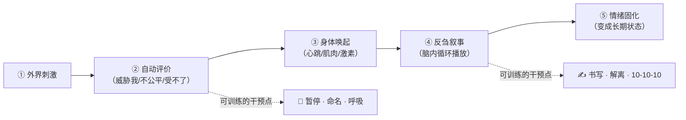
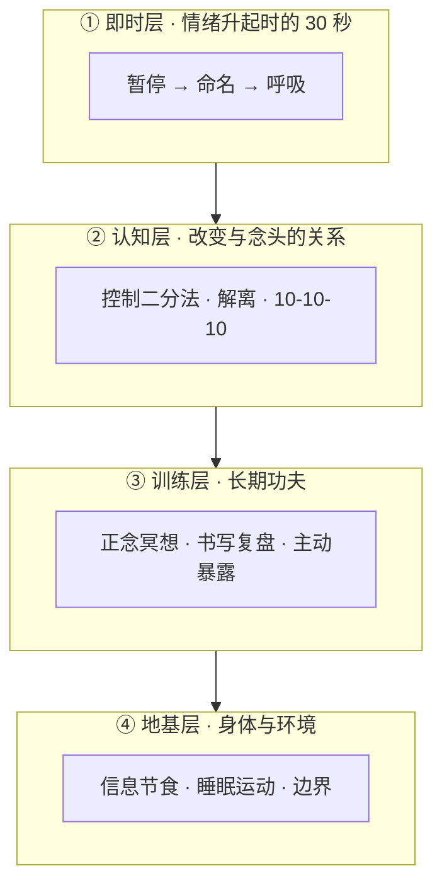
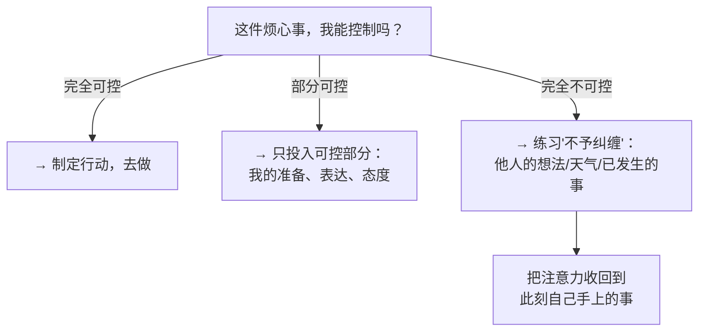

# 情绪不受外界干扰：提升感知力与心平气和的完整指南

> **一句话核心**：心平气和不是"对外界无感"，而是**缩短情绪从升起到平息的半衰期，并且不把情绪当作行动的指令**。"提升感知力"与"不被干扰"不是对立面，而是同一件事的两端——看得越清楚，越能提前看见风浪；反应越稳，风浪就越只是风景。

相关文档：[[中国为什么会诞生出那么多高认知的穷人？ - 理性情绪实验室 的回答]]

---

## 1. 背景：先拆开这个悖论

大多数人的直觉是：**敏感 → 受伤**，所以本能地想让自己钝感、麻木、"别想那么多"。但这条路走不通，因为——

**真正让人痛苦的从来不是"感知"本身，而是感知之后的自动化反应链：**



你无法关掉第①步（那是感受力本身），但第②④步——**评价与反刍**——是可以训练的。

三条古老的智慧传统和一门现代科学，指向的是同一个状态：

| 传统 | 概念 | 含义 |
|------|------|------|
| 佛教心理学 | **舍（Upekkhā / Equanimity）** | 清楚地看见，但不被拉向贪或嗔 |
| 斯多葛学派 | **控制二分法** | 只管自己权内之事，其余不予纠缠 |
| 现代心理学 | **认知解离（Cognitive Defusion）** | 念头是心理事件，不是事实本身 |
| 神经科学 | **情绪调节 / 多迷走神经理论** | 唤起可被身体手段主动下调 |

它们的共同表述是：**看得清楚，但不被牵着走。**

---

## 2. 分析：我们为什么会被外界搅动

### 2.1 威胁偏好（Negativity Bias）

大脑对负面信息的敏感度远高于正面信息——坏消息更快抓住注意、记得更牢、引发更强的生理反应。这是几十万年在危险环境中进化出来的生存配置：**宁可把绳子误看成蛇，也不能把蛇误看成绳子。**

→ 推论：容易被负面事件搅动，是**出厂设置**，不是性格缺陷。训练的目标不是删除这个设置，而是缩短它的"接管时间"。

### 2.2 认知融合（Cognitive Fusion）

把"我产生了一个念头"直接等同于"这是事实"。例如：

- 领导一句平淡的反馈 → 瞬间被解读为"他要淘汰我" → 恐惧升起。
- 朋友没回消息 → "他对我有意见" → 焦虑升起。

融合状态下，**评价（②）和刺激（①）之间没有时间差**，刺激直达情绪，人就成了环境的反应器。

### 2.3 反刍放大（Rumination）

事件本身造成的痛苦通常只占一小部分，剩下的绝大部分来自**事后反复回放**：重演对话、预想冲突、自我审判。反刍让一个 5 分钟的事件产生 5 小时的生理唤起。

### 2.4 边界缺失

把不可控的事（他人的看法、环境的变动、已经发生的过去）当成自己"应该负责、应该搞定"的事。注意力长期投放在不可控区域，产生的是**慢性失控感**——这是焦虑最主要的燃料。

---

## 3. 结论：心平气和的精确定义

> **心平气和 = 开放的觉察 + 清醒的选择权。**
> 对外界保持开放的觉察（感知力不降），对反应保持清醒的选择权（不被自动程序接管）。

三个可操作的衡量标准：

1. **恢复半衰期**：被搅动后，多久能回到基线？（目标：从天级 → 小时级 → 分钟级）
2. **行动不被劫持**：情绪升起时，是否还能选择"现在不做、现在不说"？
3. **叙事不发酵**：事后脑内重播次数是否在减少？

这是一种**可训练的神经技能**，不是天赋，也不是性格。下面按"即时 → 认知 → 长期训练 → 环境地基"四层给出完整方案。

---

## 4. 方案：四层练习体系



### 4.1 即时层：情绪升起时的 30 秒

**第一步：暂停（Pause）**

维克多·弗兰克尔（Viktor Frankl）的名言：

> "刺激与反应之间有一个空间。在那个空间里，藏着我们的选择与自由。"

情绪升起的前 3~5 秒是杏仁核劫持期，此时做出的反应几乎必然是自动程序。具体做法：

- 什么都不做、什么都不说（不发微信、不回复、不做决定）；
- 给自己 3 次缓慢的深呼吸，只感受呼吸；
- 如果是面对面对话，可以说"让我想一下"来合法地争取停顿。

**第二步：命名（Name it to tame it）**

在心里说出情绪的名字："这是愤怒""这是被轻视的羞耻""这是对失控的焦虑"。

UCLA 的 affect labeling 研究（Lieberman et al., 2007）用 fMRI 证实：**仅仅是给情绪贴标签，杏仁核激活就会下降，前额叶调控区激活上升。** 原理是：命名把体验从"沉浸式的身体风暴"转换成"语言化的观察对象"，激活的是大脑的表征系统而非威胁系统。

技巧：命名要具体、不评判。不是"我真糟糕"，而是"我现在感到委屈，因为我的努力没被看见"。

**第三步：生理干预（身体比道理快）**

情绪首先是身体事件（心跳、肌肉紧张、激素），从身体入手比讲道理快得多：

| 技术 | 做法 | 原理 |
|------|------|------|
| **生理性叹息**（Physiological Sigh） | 两次短吸 + 一次长呼，重复 3~5 次 | 快速排出 CO₂，即时降低唤起；斯坦福 Huberman 团队研究证实这是最快的即时降压呼吸 |
| **4-7-8 呼吸** | 吸 4 秒、屏 7 秒、呼 8 秒 | 延长呼气激活迷走神经副交感分支 |
| **身体扫描 10 秒** | 从脚到头快速感受紧张部位，有意识放松 | 打断"思维反刍 ↔ 肌肉紧张"的循环 |

> 💡 关键认知：**你不需要"说服自己别生气"，你只需要让身体先安静 30 秒。** 情绪半衰期本来就只有几分钟，生理唤起下降后，认知空间才会重新打开。

### 4.2 认知层：改变与念头的关系

**工具一：控制二分法（Dichotomy of Control）**

斯多葛哲学家爱比克泰德（Epictetus）的核心教诲：

> "有些事取决于我们，有些事不取决于我们。"

任何让你烦心的事，先做这一个分类：



绝大多数焦虑来自**想控制不可控之物**：别人的评价、事情的最终结果、过去。把"我希望它发生"错当成"我必须让它发生"。区分之后你会发现：可控的部分往往很小，但足够你行动；不可控的部分很大，但根本不需要你背负。

**工具二：认知解离（Defusion）**

改变和念头的关系，从"被念头淹没"变成"观察念头"：

| 融合句式（被念头控制） | 解离句式（观察念头） |
|------------------------|----------------------|
| "我完蛋了" | "我注意到，我产生了'我完蛋了'这个念头" |
| "他不尊重我" | "我的大脑正在给我讲'他不尊重我'的故事" |
| "我肯定做不到" | "这是'我做不到'的想法，又来了" |

主语一变，你从**念头的内部**移动到了**念头的观察者位置**。念头还在，但它失去了直接指挥身体的权力。这是 ACT（接纳承诺疗法）的核心技术之一。

**工具三：10-10-10 法则**

对任何当下"天大"的事，问三个问题：

1. 这件事在 **10 分钟后**还重要吗？
2. 在 **10 个月后**还重要吗？
3. 在 **10 年后**还重要吗？

多数强烈情绪源于**时间视野被压缩到当下 10 分钟**。拉长时间轴，情绪的"体积"会自然缩小——这不是自我欺骗，而是恢复事件本来的比例。

### 4.3 训练层：长期功夫

即时层和认知层是"救火"，训练层才是"防火"——它改变的是神经回路本身。

**练习一：正念冥想（每天 10 分钟）**

核心只有一件事：**觉察走神，温和地把注意力拉回来。** 每一次"拉回来"，就是在锻炼"刺激-反应之间踩刹车"的那块肌肉。

入门路径：

1. **第 1~2 周**：专注呼吸。坐着，闭眼，注意气息进出鼻孔的感觉。走神了（一定会走神），发现后不自责，轻轻带回呼吸。10 分钟即可。
2. **第 3~4 周**：扩展到身体扫描。从头顶到脚趾依次感受各部位的感觉，不评判。
3. **第 5 周起**：开放觉察。不专注任何特定对象，只是观察当下浮现的念头、声音、感觉，看它们升起、停留、消失。

推荐资源：

| 资源 | 说明 |
|------|------|
| MBSR 8 周课程 | 卡巴金（Jon Kabat-Zinn）创建的正念减压标准课程，有大量临床实证 |
| 《正念的奇迹》一行禅师 | 极简入门，把正念融入洗碗、喝茶等日常 |
| Headspace / 潮汐 App | 引导式练习，适合完全没基础的人 |

> 研究证据：8 周 MBSR 可显著降低焦虑、抑郁量表分数，fMRI 显示杏仁核灰质密度下降、前额叶-杏仁核功能连接增强（Hölzel et al., 2011）。**这不是玄学，是可测量的脑结构变化。**

**练习二：书写复盘（每晚 5~10 分钟）**

每天睡前写下当天"被搅动"的时刻，用本文的框架拆解：

```
【事件】发生了什么（客观描述，不加评价）
【情绪】我当时感受到了什么（命名它）
【自动念头】大脑第一时间讲了什么故事
【检验】这是事实还是解读？可控还是不可控？
【如果重来】暂停之后，我可以选择怎么做
```

书写的力量在于：**写下来，反刍就失去了循环播放的燃料。** 未完成的心理事件会被大脑反复"后台运行"（蔡格尼克效应），一旦落成文字，大脑会认为"已处理"，循环停止。

**练习三：主动暴露（带着觉察去经历）**

不要逃避让你不适的场景。逃避短期减轻焦虑，长期让敏感变成恐惧；而带着觉察直面，敏感会转化为洞察。

- 怕冲突 → 从小事开始练习表达不同意见（"我理解你的想法，我的看法是……"）；
- 怕被评价 → 故意做一件可能被评价的事，观察"被评价"之后实际发生了什么（通常什么都没发生）；
- 每次暴露后用书写复盘记录：预期灾难 vs 实际结果。

这就是认知行为疗法（CBT）中"行为实验"的自我版本。

### 4.4 地基层：身体与环境

地基不稳，上面的技巧都是空中楼阁。情绪耐受窗口（window of tolerance）直接受生理状态影响。

**1. 信息节食**

- 负面新闻、社交媒体的算法以"愤怒/焦虑"为燃料，你刷的每条内容都在训练你的威胁系统；
- 具体做法：新闻类 App 每天限时（如 15 分钟）、关闭非必要推送、睡前 1 小时不刷；
- 你不需要知道世界上所有的坏消息才能好好生活。

**2. 睡眠与运动**

- 睡眠不足会直接削弱前额叶对杏仁核的抑制能力——同样一句批评，睡好了能一笑置之，没睡好可能记恨一天；
- 每周 3 次以上中等强度运动（跑步、游泳、快走）对轻中度焦虑/抑郁的改善效果在元分析中与药物和心理咨询相当（Schuch et al., 2018）；
- 运动还是天然的"压力激素代谢器"：皮质醇和肾上腺素本来就是为"战或逃"的身体行动准备的，不运动它们就无处可去。

**3. 设立边界**

- 对持续消耗你的人和事，**物理上的远离是正当且必要的**——平静不等于来者不拒；
- 学会说"不"，不解释、不内疚；
- 识别三类高消耗关系：永远在抱怨但拒绝改变的人、通过贬低你来获得优越感的人、把你的善意当成无限资源的人。

---

## 5. 注意事项：四个常见误区

1. **不要追求"无感"。** 压抑 ≠ 平静。压抑只是把情绪推迟，它会在别处以更猛烈的方式爆发（失眠、暴食、躯体疼痛、突然的暴怒）。目标是"情绪穿过我，但不停留"，不是"情绪不许进来"。正念的态度是**允许它存在，但不喂它**。

2. **这是技能，不是顿悟。** 神经回路的重塑以周和月计。偶尔被搅动完全正常，不要因为"我又生气了"而二次自责——那是在原来的情绪上再叠加一层羞耻，双重燃料。衡量进步的标准是**半衰期在缩短**，而不是"不再被触发"。

3. **警惕"灵性逃避"（Spiritual Bypassing）。** 用"一切皆空""我要平和"当借口，回避该面对的问题、该表达的不满、该争取的权益。真正的平和包含清晰的行动力——看见不公仍然愤怒，但愤怒不再扭曲你的判断和手段。

4. **识别需要专业帮助的信号。** 如果负面情绪已持续影响睡眠、食欲、工作/学习超过两周，或出现持续的无价值感、自伤念头，那超出了自我调节的范畴。寻求心理咨询/精神科帮助是更聪明的选择，不是软弱——就像骨折该去医院，而不是在家练呼吸。

---

## 6. 总结

一张表回顾全文：

| 层次 | 时机 | 核心动作 | 关键原理 |
|------|------|----------|----------|
| 即时层 | 情绪升起的 30 秒 | 暂停 → 命名 → 呼吸 | 命名降低杏仁核激活；呼气激活副交感 |
| 认知层 | 情绪持续时 | 控制二分法、解离句式、10-10-10 | 切断"评价→唤起"的自动化链接 |
| 训练层 | 每天 10~20 分钟 | 正念、书写复盘、主动暴露 | 重塑前额叶-杏仁核回路 |
| 地基层 | 生活方式 | 信息节食、睡眠运动、边界 | 扩大情绪耐受窗口 |

一句话收束：

> **对外界保持开放的觉察，对反应保持清醒的选择权。**
> 感知力越高，你越能提前看见风浪；反应力越稳，风浪就越只是风景。

---

## 参考

- Kabat-Zinn, J. (1990). *Full Catastrophe Living*（MBSR 正念减压）
- Lieberman et al. (2007). Putting feelings into words: affect labeling disrupts amygdala activity. *Psychological Science*
- Hölzel et al. (2011). Mindfulness practice leads to increases in regional brain gray matter density. *Psychiatry Research: Neuroimaging*
- Harris, R. (2009). *ACT Made Simple*（接纳承诺疗法，认知解离）
- Epictetus. *Enchiridion*（斯多葛控制二分法）
- Frankl, V. (1946). *Man's Search for Meaning*
- Schuch et al. (2018). Physical activity and incident depression: a meta-analysis. *Am J Psychiatry*

